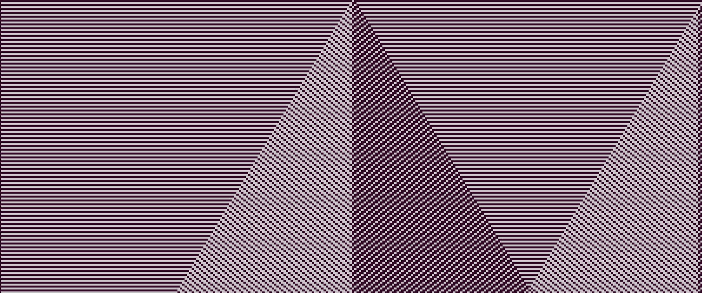

# Клеточные автоматы

В строке ввода задаётся номер правила клеточного автомата в виде числа от 0 до 255. Число переводится в двоичную систему и каждый бит задаёт положение центральной клетки для определённой комбинации из 3 подряд идущих клеток

Примеры:

Правило 105

Правило 99

Правило 129
